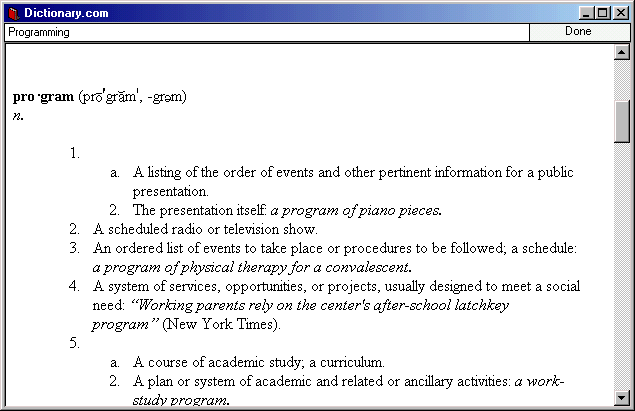



## Dictionary\.com

### Description

Very simple code that using the Internet Explorer OCX and the Dictionary.com to translate words (English/English). Useful as application and you might learn something from the code (even though there is not much of it).
 
### More Info
 

             |
---                |---
**Submitted On**   |2001-04-21 01:53:10
**By**             |[Vitaly](https://github.com/Planet-Source-Code/PSCIndex/blob/master/ByAuthor/vitaly.md)
**Level**          |Beginner
**User Rating**    |4.6 (65 globes from 14 users)
**Compatibility**  |VB 5\.0, VB 6\.0
**Category**       |[Internet/ HTML](https://github.com/Planet-Source-Code/PSCIndex/blob/master/ByCategory/internet-html__1-34.md)
**World**          |[Visual Basic](https://github.com/Planet-Source-Code/PSCIndex/blob/master/ByWorld/visual-basic.md)
**Archive File**   |[Dictionary186134202001\.zip](https://github.com/Planet-Source-Code/vitaly-dictionary-com__1-22564/archive/master.zip)

